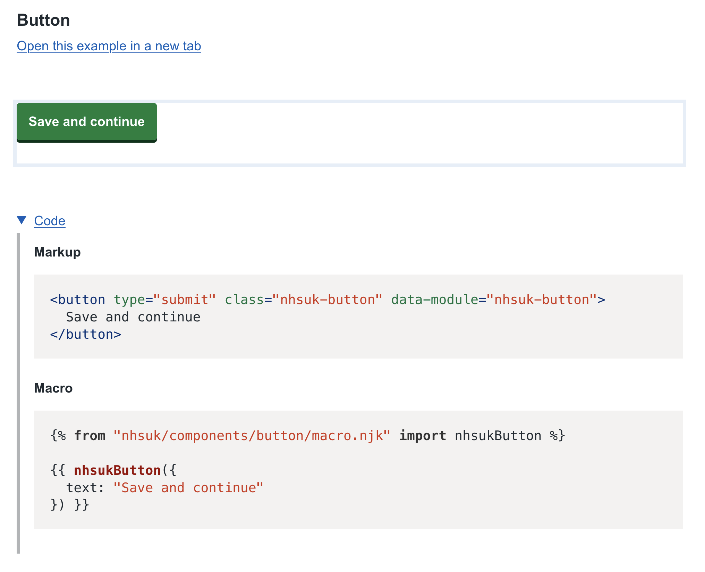

# GOVUK to NHSUK Frontend

This is a quick spike to show how you can use code transformers to convert GOVUK frontend.

It is using `postcss` to convert the SCSS files into its Abstract Syntax Tree (AST) and then updating and adding values.

## Assumptions

- we are copying the GOVUK frontend and replacing all occurrences of `govuk` with `nhsuk`

## How to run

```bash
pnpm install

pnpm build
```

The script should output the processed files in the `nhsuk-frontend` directory. You should be able to restore the dependencies of the `nhsuk-frontend` and run the project.

Here's a preview of what the button will look like:

